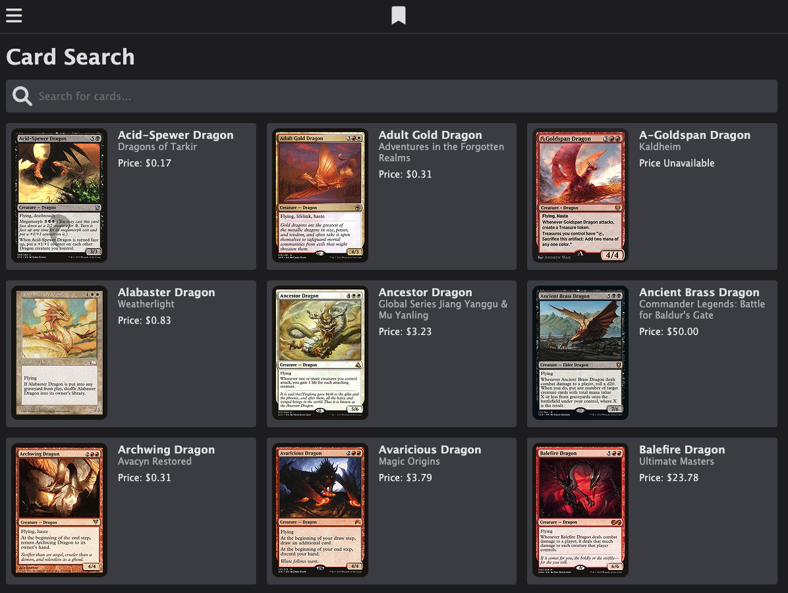
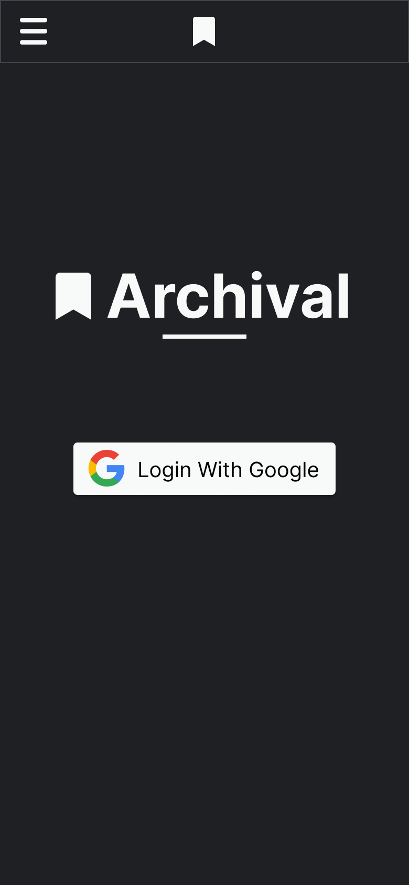
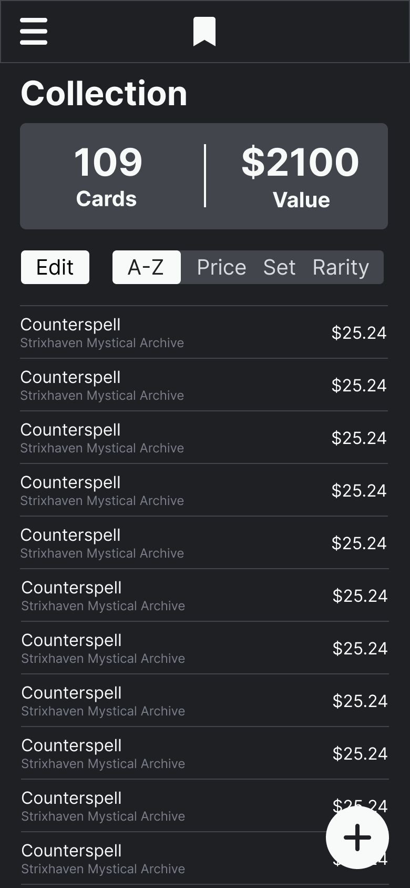
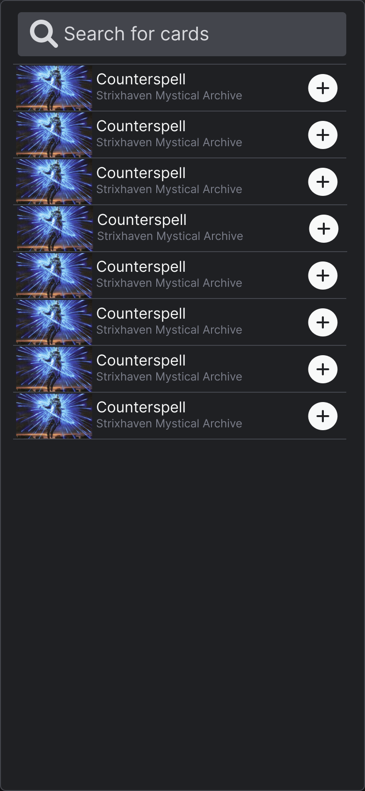
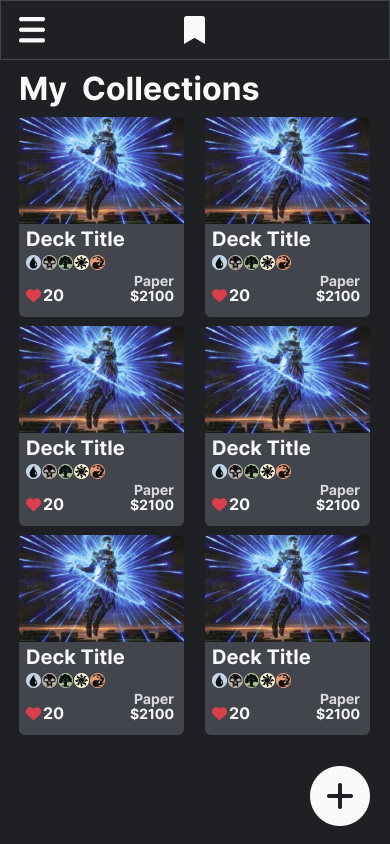
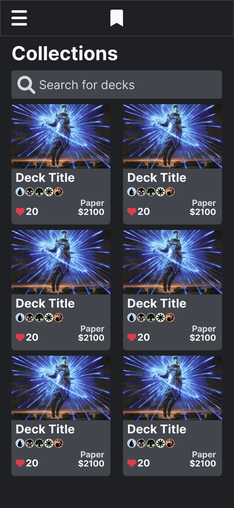
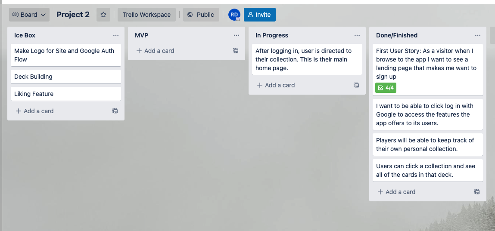

# MTG Archive

    
    <h1>Archival</h1>
    <h3><a href="https://archival-mtg.herokuapp.com/" target="_blank">Visit Archival</a></h3>
    <h3>Roger Davila</h3>
         
    

# About Archival
Archival is a web application built using Mongoose, Express, and MongoDB to keep track of your personal Magic the Gathering Collection, and to see other collections! 

# How to Use Archival

### The Basics
You can use archival as a search database just to see what Magic the gathering cards are out there.

### Getting the Most Out of It
If you want to get the most out of using Archival, sign in with your google account and start making collections! When you have an account, when you search cards you will be able to select a drop down of your collections and add the card you want to it.

### Social Component
You can see the collections that others have made too so that you can keep an eye out on what the collection of your community members are like!

 :art: Wireframes

I used figma to quickly sketch up some basic views and wireframes to get a feel of what the application will be like. I went with a mobile first approach to make sure that the experience is enjoyable on smaller screens.

.table-wrapper {
  overflow-x: scroll;
}

| View | Image |
|------------ | ------------|
| 
Login Page
 |  |
| 
Collection Page
 |  |
| 
Search Page 
 |  |
| 
My Collections
 |  |
| 
All Collections
 |  |

:white_check_mark: Planning

Used Trello to keep track of the user stories that were being implemented for this project. Pre-defining what we wanted the user to experience to be allowed the project executions phase to go smoothly.

## :computer: Technologies Used

 
 
 

# Getting Started

[Click to Visit Archival!](https://archival-mtg.herokuapp.com/)

## :fast_forward: Next Steps 
### Upcoming Features
- [ ] Deck Building
- [ ] Collection Value Tracker
- [ ] Sorting
- [ ] Compact Views
- [ ] Advanced Search Features
- [ ] Single Card Detailed View